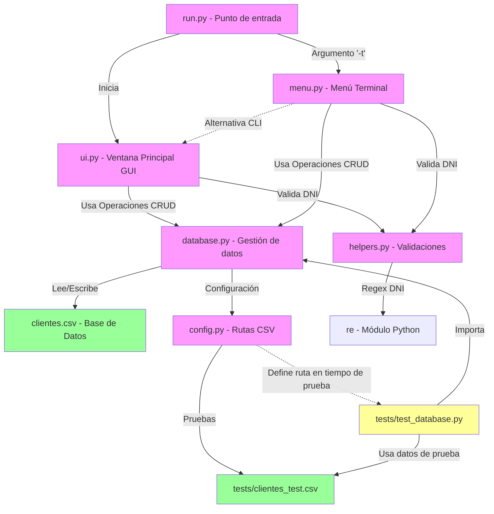

```mermaid
graph TD
    %% Módulos Principales
    A[run.py - Punto de entrada] -->|Inicia| B[ui.py - Ventana Principal GUI]
    A -->|Argumento '-t'| C[menu.py - Menú Terminal]
    B -->|Usa Operaciones CRUD| D[database.py - Gestión de datos]
    C -->|Usa Operaciones CRUD| D
    B -->|Valida DNI| E[helpers.py - Validaciones]
    C -->|Valida DNI| E
    D -->|Lee/Escribe| F[clientes.csv - Base de Datos]
    D -->|Configuración| G[config.py - Rutas CSV]
    G -->|Pruebas| H[tests/clientes_test.csv]
    
    %% Módulos de Testing
    I[tests/test_database.py] -->|Importa| D
    I -->|Usa datos de prueba| H
    
    %% Dependencias Externas
    E -->|Regex DNI| J[re - Módulo Python]
    
    %% Estilos
    classDef py fill:#f9f,color:#333;
    classDef csv fill:#9f9,color:#333;
    classDef test fill:#ff9,color:#333;
    class A,B,C,D,E,G,I py
    class F,H csv
    class I test

    %% Relaciones Especiales
    G -.->|Define ruta en tiempo de prueba| I
    C -.->|Alternativa CLI| B
```
